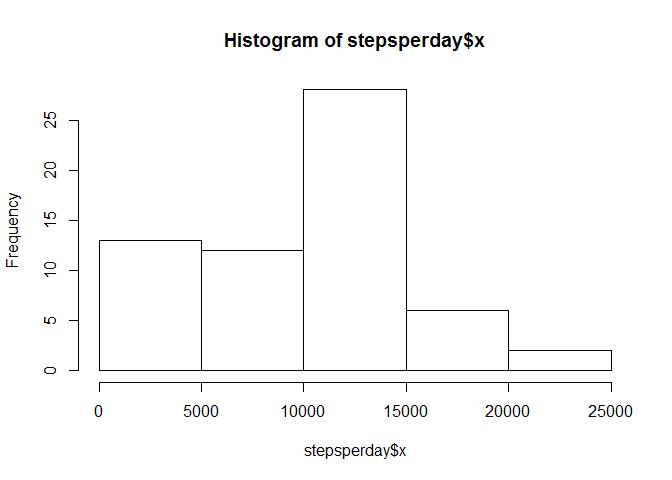
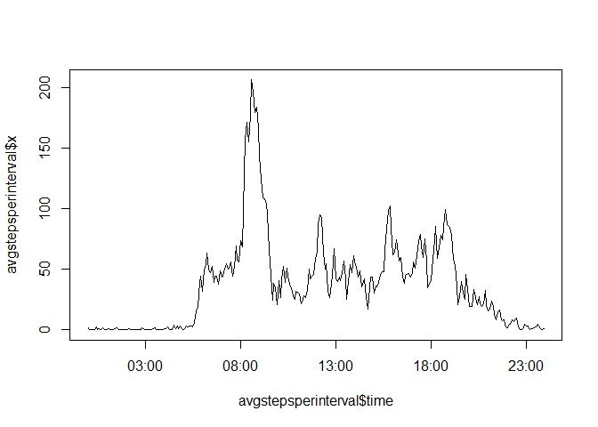
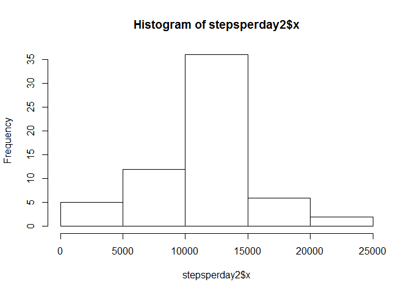
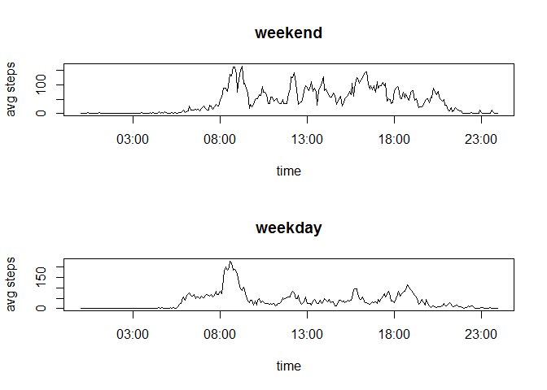

# Reproducible Research: Peer Assessment 1


## Loading and preprocessing the data

```r
activity<-read.csv("activity.csv", colClasses = c("integer","character","integer"))
str(activity)
```

```
## 'data.frame':	17568 obs. of  3 variables:
##  $ steps   : int  NA NA NA NA NA NA NA NA NA NA ...
##  $ date    : chr  "2012-10-01" "2012-10-01" "2012-10-01" "2012-10-01" ...
##  $ interval: int  0 5 10 15 20 25 30 35 40 45 ...
```

```r
stepsperday<-aggregate(activity$steps, list(activity$date), sum, na.rm=T)
hist(stepsperday$x)
```

 

```r
mean(stepsperday$x)
```

```
## [1] 9354.23
```

```r
median(stepsperday$x)
```

```
## [1] 10395
```

## What is mean total number of steps taken per day?
9354.23 steps per day
[1] 9354.23
[1] 10395

## What is the average daily activity pattern?

```r
avgstepsperinterval<-aggregate(activity$steps, list(activity$interval), mean, na.rm=T)
library(stringr)
paddedinterval<-str_pad(as.character(avgstepsperinterval$Group.1),4,pad="0")
avgstepsperinterval$time <- strptime(paddedinterval, "%H%M")
plot(avgstepsperinterval$time,avgstepsperinterval$x,type = "l")
```

 

```r
avgstepsperinterval[avgstepsperinterval$x==max(avgstepsperinterval$x),]
```

```
##     Group.1        x                time
## 104     835 206.1698 2016-01-25 08:35:00
```
The 5-minute interval that contains the maximum number of steps is the one that starts at 8:35 and ends by 8:40.

## Imputing missing values

```r
table(is.na(activity$date))
```

```
## 
## FALSE 
## 17568
```

```r
table(is.na(activity$interval))
```

```
## 
## FALSE 
## 17568
```

```r
table(is.na(activity$steps))
```

```
## 
## FALSE  TRUE 
## 15264  2304
```

```r
table(is.na(activity$date) | is.na(activity$interval) | is.na(activity$steps))
```

```
## 
## FALSE  TRUE 
## 15264  2304
```
there are 2304 missing values in the dataset

Create a new dataset filing in the missing values with the mean for each 5-minute interval.

```r
head(activity)
```

```
##   steps       date interval
## 1    NA 2012-10-01        0
## 2    NA 2012-10-01        5
## 3    NA 2012-10-01       10
## 4    NA 2012-10-01       15
## 5    NA 2012-10-01       20
## 6    NA 2012-10-01       25
```

```r
head(avgstepsperinterval)
```

```
##   Group.1         x                time
## 1       0 1.7169811 2016-01-25 00:00:00
## 2       5 0.3396226 2016-01-25 00:05:00
## 3      10 0.1320755 2016-01-25 00:10:00
## 4      15 0.1509434 2016-01-25 00:15:00
## 5      20 0.0754717 2016-01-25 00:20:00
## 6      25 2.0943396 2016-01-25 00:25:00
```

```r
activity$id<-seq(1:length(activity$steps))
g<-merge(activity, avgstepsperinterval, by.x = "interval", by.y = "Group.1")
g[is.na(g$steps),]$steps<-g[is.na(g$steps),]$x
h<-g[order(g$id),]
activity2<-h[,c("steps","date","interval")]
```

```r
head(activity2)
```

```
##         steps       date interval
## 1   1.7169811 2012-10-01        0
## 63  0.3396226 2012-10-01        5
## 128 0.1320755 2012-10-01       10
## 205 0.1509434 2012-10-01       15
## 264 0.0754717 2012-10-01       20
## 327 2.0943396 2012-10-01       25
```

```r
stepsperday2<-aggregate(activity2$steps, list(activity2$date), sum, na.rm=T)
hist(stepsperday2$x)
```

 

```r
mean(stepsperday2$x)
```

```
## [1] 10766.19
```

```r
median(stepsperday2$x)
```

```
## [1] 10766.19
```
The mean is different (old: 9354.23 - new: 10766.19), while the median is the same (old: 10395 - new: 10766.19). 

Keeping the mean steps by interval caused both, the mean total steps by day and the median total steps per day, to increase.

## Are there differences in activity patterns between weekdays and weekends?

Use English locale names

```r
library(stringr)
mylocale<-Sys.getlocale()
mylocale<-strsplit(mylocale, split = ";")
lctime<-mylocale[[1]][grepl("LC_TIME", mylocale[[1]])]
mylctime<-substr(lctime, gregexpr("=", lctime)[[1]][1] + 1, nchar(lctime))
Sys.setlocale("LC_TIME", "English")
```

```
## [1] "English_United States.1252"
```

Start activity

```r
myweekdays <- c('Monday', 'Tuesday', 'Wednesday', 'Thursday', 'Friday')
activity2$weekday<-factor(weekdays(as.Date(activity2$date)) %in% myweekdays, levels = c(T,F), labels = c("weekday", "weekend"))

activityweekend<-activity2[activity2$weekday=="weekend",]
activityweekday<-activity2[activity2$weekday=="weekday",]
avgstepsperintervalwend<-aggregate(activityweekend$steps, list(activityweekend$interval), mean, na.rm=T)
avgstepsperintervalwday<-aggregate(activityweekday$steps, list(activityweekday$interval), mean, na.rm=T)
paddedintervalend<-str_pad(as.character(avgstepsperintervalwend$Group.1),4,pad="0")
paddedintervalday<-str_pad(as.character(avgstepsperintervalwday$Group.1),4,pad="0")
avgstepsperintervalwend$time <- strptime(paddedintervalend, "%H%M")
avgstepsperintervalwday$time <- strptime(paddedintervalday, "%H%M")

par(mfrow=c(2,1)) 

plot(avgstepsperintervalwend$time,avgstepsperintervalwend$x,type = "l", xlab = "time", ylab = "avg steps")
title(main = "weekend")
plot(avgstepsperintervalwday$time,avgstepsperintervalwday$x,type = "l", xlab = "time", ylab = "avg steps")
title(main = "weekday")
```

 

Revert locale names to native locale

```r
Sys.setlocale("LC_TIME", mylctime)
```

```
## [1] "Portuguese_Brazil.1252"
```
